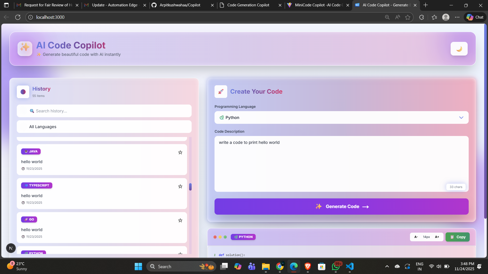

# AI Code Copilot

Modern AI-powered code generation tool with glassmorphism UI.



## Tech Stack

**Frontend:** Next.js, TypeScript, Tailwind CSS  
**Backend:** Node.js, Express, PostgreSQL  
**AI:** Google Gemini API

## Project Structure

```
├── frontend/          # Next.js app
│   ├── app/          # Pages & API routes
│   ├── components/   # React components
│   └── contexts/     # State management
├── backend/          # Express API
│   ├── src/          # Server & controllers
│   └── migrations/   # Database migrations
└── docs/             # Documentation
```

## Setup

1. **Frontend:**
   ```bash
   cd frontend
   npm install
   npm run dev
   ```

2. **Backend:**
   ```bash
   cd backend
   npm install
   npm start
   ```

3. **Environment Variables:**
   - Backend: `GEMINI_API_KEY`, `DATABASE_URL`
   - Frontend: `NEXT_PUBLIC_API_URL`

## License

MIT
