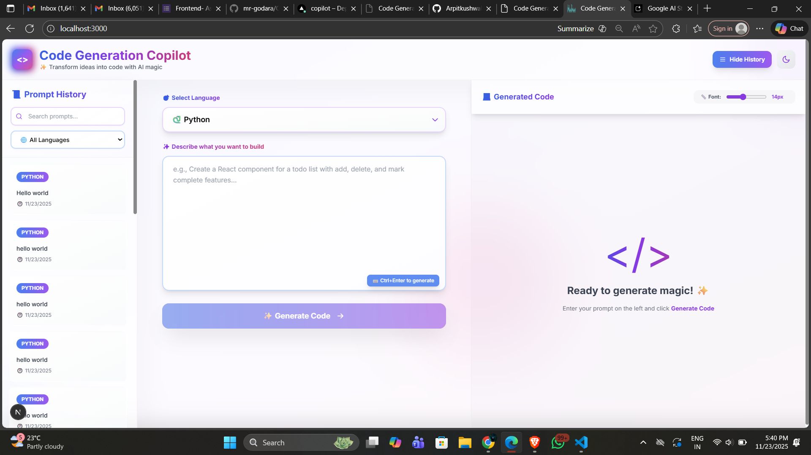

# Code Generation Copilot

AI-powered code generation using natural language prompts.

---

## 📁 Project Structure

code-copilot/
├── frontend/              # Next.js React Frontend
│   ├── app/              # Next.js App Router
│   │   ├── api/         # API routes (legacy)
│   │   ├── docs/        # Documentation page
│   │   ├── globals.css  # Global styles
│   │   ├── layout.tsx   # Root layout
│   │   └── page.tsx     # Main page
│   ├── components/       # React components
│   ├── contexts/         # React Context providers
│   ├── lib/             # Utility functions
│   ├── public/          # Static assets
│   ├── types/           # TypeScript definitions
│   ├── package.json     # Frontend dependencies
│   ├── next.config.js   # Next.js configuration
│   ├── tailwind.config.ts
│   ├── tsconfig.json
│   └── .env.example     # Frontend environment template
│
├── backend/              # Node.js Express API
│   ├── src/
│   │   ├── config/      # Database configuration
│   │   ├── controllers/ # Business logic
│   │   ├── routes/      # API endpoints
│   │   ├── swagger/     # Swagger documentation
│   │   └── server.js    # Entry point
│   ├── migrations/      # SQL schema & seed data
│   │   ├── 001_initial_schema.sql
│   │   ├── 002_seed_data.sql
│   │   └── run-migrations.js
│   ├── verify-db.js     # Database verification script
│   ├── package.json     # Backend dependencies
│   └── .env.example     # Backend environment template
│
├── docs/                # Documentation & Diagrams
│   ├── er-diagram.svg   # ER Diagram (visual)
│   ├── er-diagram.dbml  # ER Diagram (code)
│   └── README.md        # Docs readme
│
├── .env.example         # Root environment template
├── README.md            # This file
└── .gitignore          # Git ignore rules

---

## 🚀 Setup Instructions

### Prerequisites
* Node.js 18+
* PostgreSQL 14+
* [Gemini API Key](https://aistudio.google.com/app/apikey)

### Backend Setup
bash
cd backend
npm install
cp .env.example .env
# Edit .env with DATABASE_URL and GEMINI_API_KEY
createdb code_copilot
npm run migrate
npm run dev  # http://localhost:5000

### Frontend Setup
bash
cd frontend
npm install
cp .env.example .env.local
# Set NEXT_PUBLIC_API_URL=http://localhost:5000
npm run dev  # http://localhost:3000

---

## 🏗 Architecture Decisions

*Frontend (Next.js):*
* SSR for better performance and SEO
* TailwindCSS for rapid UI development
* TypeScript for type safety

*Backend (Express):*
* RESTful API with PostgreSQL
* 3NF normalized schema (users, languages, generations)
* 8 optimized indexes for fast queries

*Database Design:*
* Foreign keys: users (1:N) generations, languages (1:N) generations
* Indexes on created_at DESC, user_id, language_id for O(log n) lookups
* Composite index (user_id, created_at DESC) for user-specific pagination

*AI (Gemini API):*
* Low latency (~2-5s)
* Free tier for development
* Multi-language support

---

## ✨ Implemented Features

* ✅ AI code generation (7 languages: Python, JS, TS, Java, C++, Go, Rust)
* ✅ Syntax highlighting with copy-to-clipboard
* ✅ Paginated history with language filtering
* ✅ Usage statistics dashboard
* ✅ Interactive API documentation (Swagger UI)
* ✅ Rate limiting (100 req/min)
* ✅ Security: Helmet.js, CORS, parameterized queries
* ✅ Database: 3NF schema with optimized indexes

---

## 🔮 Future Improvements

*High Priority:*
* User authentication (JWT)
* Code execution sandbox (Docker)
* Real-time collaboration (WebSockets)
* Advanced prompt templates

*Medium Priority:*
* Code quality analysis (linting, syntax checking)
* Version control integration (Git)
* Full-text search (Elasticsearch)
* Export options (files, GitHub Gist)

*Low Priority:*
* Multiple AI models (GPT-4, Claude)
* Mobile app (React Native)
* Analytics dashboard

*Technical Debt:*
* Unit/integration tests
* CI/CD pipeline
* Error monitoring (Sentry)
* Redis caching

---

## 📡 API Documentation

### Interactive API Docs (Swagger)

Access the interactive API documentation at:

http://localhost:5000/api-docs

Swagger UI provides:
* Live API testing interface
* Request/response examples
* Schema definitions
* Authentication testing

### Example API Payloads

#### Generate Code
*Request:*
json
POST /api/generate
{
  "prompt": "Write a Python function to check if a number is prime",
  "language": "Python",
  "userId": 1
}

*Response:*
json
{
  "success": true,
  "data": {
    "id": 123,
    "code": "def is_prime(n):\n    if n <= 1:\n        return False\n    ...",
    "language": "Python",
    "timestamp": "2025-01-23T14:30:00.000Z"
  }
}

#### Get History
*Request:*

GET /api/history?page=1&limit=10&language=Python

*Response:*
json
{
  "success": true,
  "data": [
    {
      "id": 123,
      "prompt": "Write a Python function...",
      "code": "def is_prime(n)...",
      "timestamp": "2025-01-23T14:30:00.000Z",
      "language": "Python"
    }
  ],
  "pagination": {
    "page": 1,
    "total": 45,
    "totalPages": 5
  }
}

#### Get Statistics
*Request:*

GET /api/stats

*Response:*
json
{
  "success": true,
  "data": {
    "totalGenerations": 127,
    "languageBreakdown": [
      { "language": "Python", "language_count": "45" },
      { "language": "JavaScript", "language_count": "38" }
    ]
  }
}

---

## 🛠 Tech Stack

*Frontend:* Next.js 15 · React 18 · TypeScript · TailwindCSS  
*Backend:* Express.js · PostgreSQL · Gemini AI · Swagger UI  
*Deploy:* Vercel · Railway · Supabase

---

## 👤 Author

*Arpit Kushwaha*  
GitHub: [@Arpitkushwahaa](https://github.com/Arpitkushwahaa)

---

Built with Next.js · Express · PostgreSQL · Gemini AI
